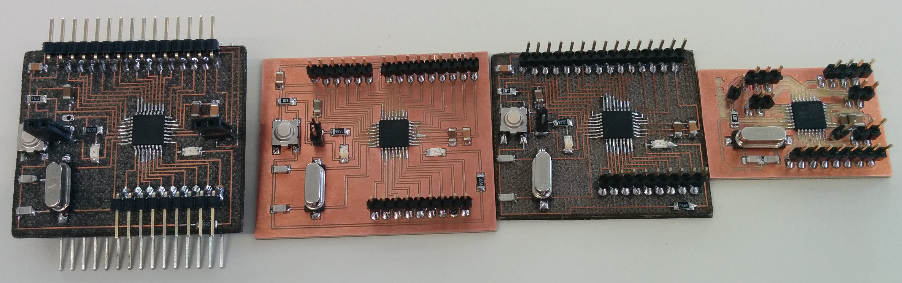
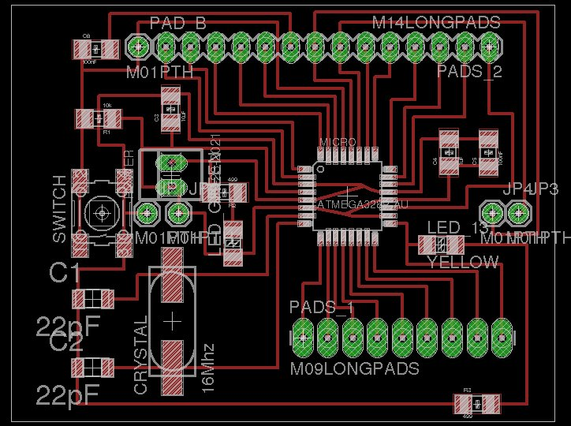
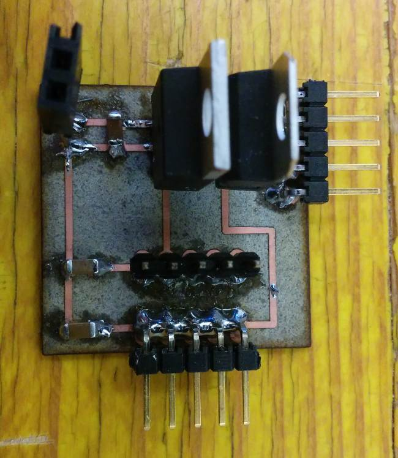
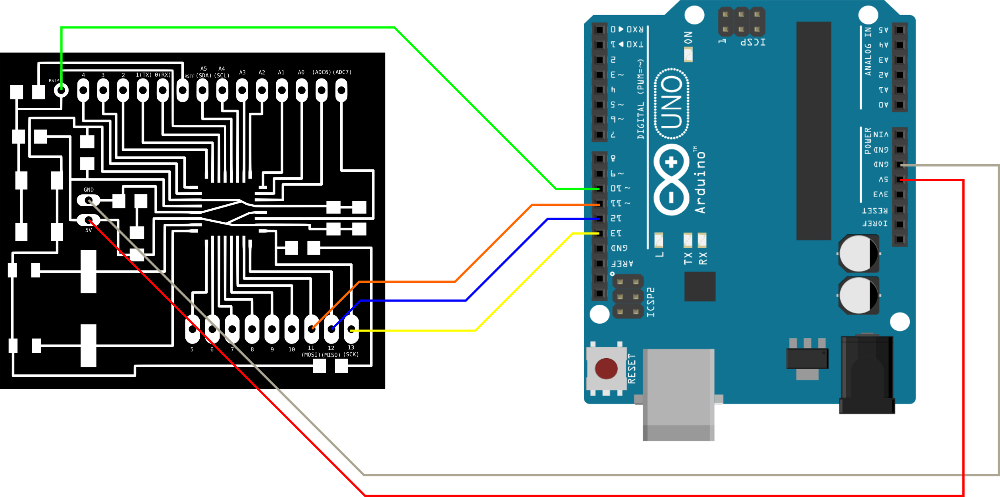
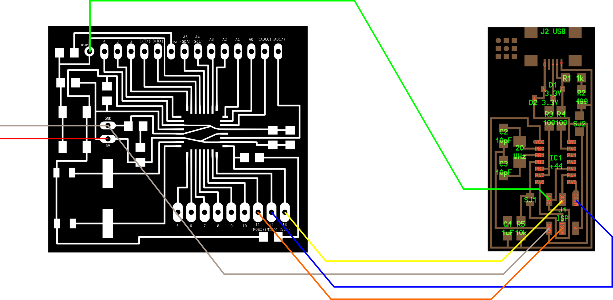
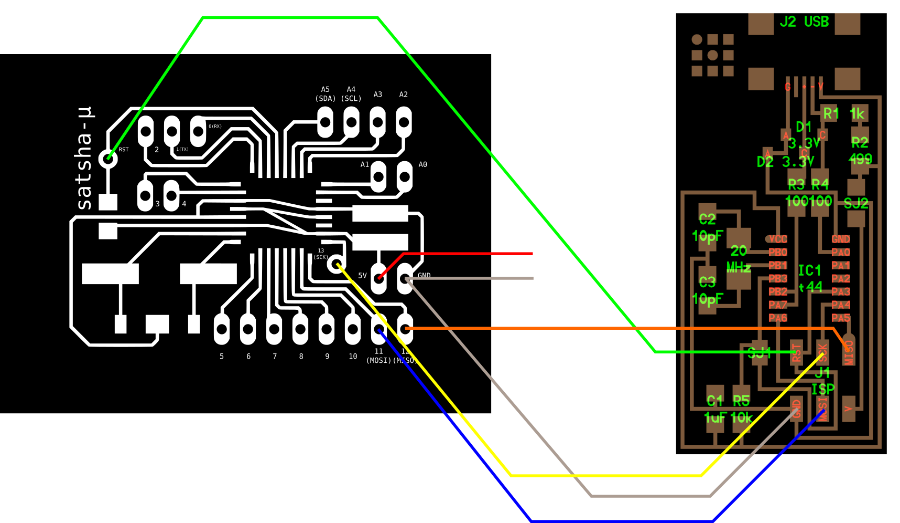
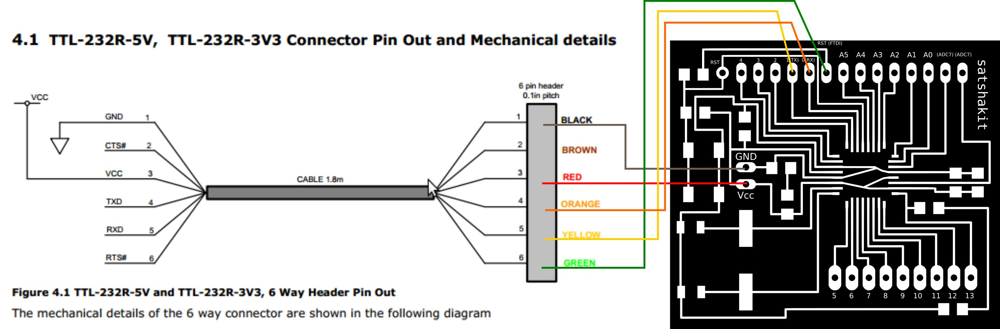
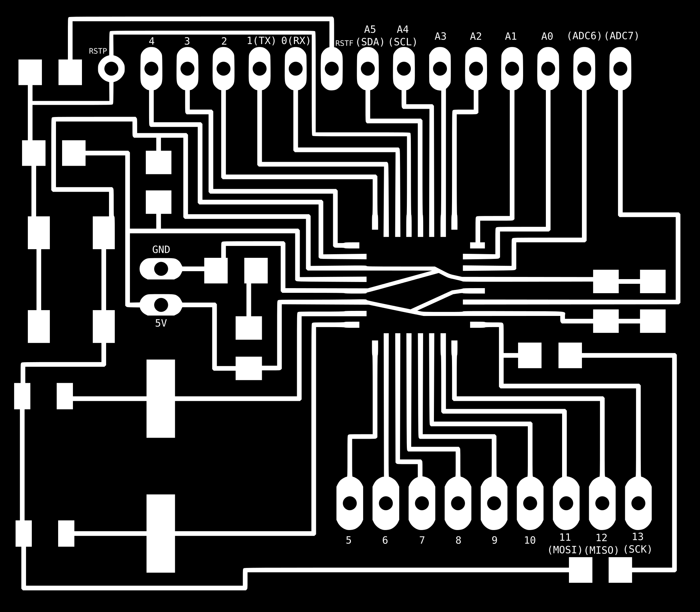
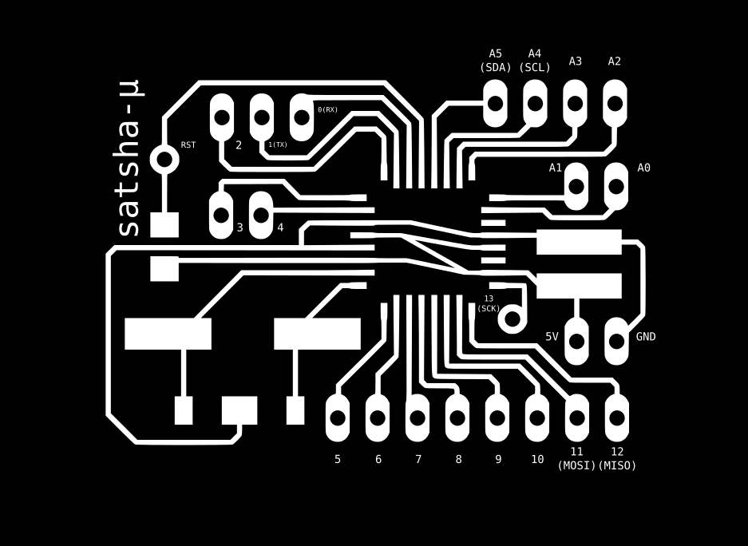

<h1 style="font-family: courier;" align="center"> satshakit</h1>

<i>An improved & fabbable 100% Arduino IDE/libraries compatible board.</i>

  

The story
--
Satshakit born during my **[FabAcademy2015](http://fabacademy.org/archives/2015/eu/students/ingrassia.daniele/index.html)**  as one the first test boards for my quadcopter final project. As some of my fellow students had difficulties with **[Fabkit](http://fabacademy.org/archives/2015/doc/projects/fabkit-0.4.html)**, they tried to make this prototype board. The board was very appreciated that now almost all my fellow students made it for their exercises, or use it as a **starting point for their final projects**. Thus I decided to do this release, if anyone wants to try it. Now, one year later, I am again in a FabLab developing new satshakit boards in my spare time.

What is satshakit?
--

Satshakit is an **100% Arduino IDE  and libraries compatible**, fabbable board, and also an improved version of [Fabkit](http://fabacademy.org/archives/2015/doc/projects/fabkit-0.4.html). 

Main **improvements and features** over Fabkit are:

- **16Mhz** instead of 8Mhz
- **crystal** instead of resonator
- **costs less** (7-9 euro vs 13 euro)
- 100% compatible with **default Arduino IDE** (satshakit is recognized as Arduino UNO)
- ADC6/7 connected instead of ADC6/7 not connected (satshakit laser and cnc)
- larger space to easy soldering (satshakit laser and cnc)

satshakit boards
--

There are different kinds of **satshakit boards** depending on the **fabrication technique** you will use to make them, or on the **size** of the board. 

Here is a comparison table about different satshakit boards:

|name|mcu|pins|size(mm)|
| :---: | :---:|:---:|:---:|
|`satshakit laser`|ATmega328P|Arduino + ADC6/7|48 x 42|
|`satshakit cnc`|ATmega328P| Arduino + ADC6/7  |54 x 45|
|`satshakit multicore`|2 x ATmega328P| 2 x Arduino + ADC6/7|50 x 42|
|`satshakit micro`| ATmega328P|Arduino|40 x 24|

satshakit laser and cnc
--

**satshakit laser** and **satshakit cnc** are the standard versions of the satshakit. They are actually the same board, showing some layout differences to improve the making process with a **fiber laser** cutter machine, or a little **cnc mill**. These satshakits are meant to be a general purpose board, having the full Arduino pinout plus ADC6/7, large space for easy soldering and two led onboard for power and pin 13.

Here is the **satshakit laser board**:

This is the **satshakit cnc board**:

**downloads**

- [satshakit cnc svg](https://raw.githubusercontent.com/satshas/satshakit/master/media/satshakit_cnc/satshakit_cnc.svg)
- [satshakit cnc internal png](https://raw.githubusercontent.com/satshas/satshakit/master/media/satshakit_cnc/satshakit_cnc_internal.png)
- [satshakit cnc holes png](https://raw.githubusercontent.com/satshas/satshakit/master/media/satshakit_cnc/satshakit_cnc_holes.png)
- [satshakit cnc cut png](https://raw.githubusercontent.com/satshas/satshakit/master/media/satshakit_cnc/satshakit_cnc_cut.png)
- [satshakit cnc cut tips png](https://raw.githubusercontent.com/satshas/satshakit/master/media/satshakit_cnc/satshakit_cnc_cut_tip.png)
- [satshakit cnc schematic](https://raw.githubusercontent.com/satshas/satshakit/master/eagle_projects/satshakit_cnc/satshakit_cnc.sch)
- [satshakit cnc board](https://raw.githubusercontent.com/satshas/satshakit/master/eagle_projects/satshakit_cnc/satshakit_cnc.brd)
- [satshakit laser svg](https://raw.githubusercontent.com/satshas/satshakit/master/media/satshakit_laser/satshakit_laser.svg)
- [satshakit laser schematic](https://raw.githubusercontent.com/satshas/satshakit/master/eagle_projects/satshakit_laser/satshakit_laser.sch)
- [satshakit laser board](https://raw.githubusercontent.com/satshas/satshakit/master/eagle_projects/satshakit_laser/satshakit_laser.brd)

**media**

satshakit laser:

satshakit cnc:

satshakit cnc blinks:

satshakit programmed with a FabISP:

Here are some videos of satshakit while is working with **different configuration and/or sensors**:

satshakit little radar, a **satshakit modified board** with an ULN2003A:

satshakit micro
--

satshakit micro is a downsized version of the satshakit laser and cnc, developed to be used in **constrained space applications** like embedding the board in textiles or in small objects or useful for who wants just a **bare metal board** to start with, also easy to be modified and/or customized. While satshakit micro is less than half the size of the other satshakits, it's a **full featured board** with the full Adruino pinout, missing only the possibility to be programmed using an FTDI cable.

Here is the **satshakit micro board**:

**downloads**

- [satshakit micro svg](https://raw.githubusercontent.com/satshas/satshakit/master/media/satshakit_micro/satshakit_micro.svg)
- [satshakit micro cut png](https://raw.githubusercontent.com/satshas/satshakit/master/media/satshakit_micro/satshakit_micro_internal.png)
- [satshakit micro holes png](https://raw.githubusercontent.com/satshas/satshakit/master/media/satshakit_micro/satshakit_micro_holes.png)
- [satshakit micro cut png](https://raw.githubusercontent.com/satshas/satshakit/master/media/satshakit_micro/satshakit_micro_cut.png)
- [satshakit micro cut tips png](https://raw.githubusercontent.com/satshas/satshakit/master/media/satshakit_micro/satshakit_micro_cut_tips.png)
- [satshakit micro schematic](https://raw.githubusercontent.com/satshas/satshakit/master/eagle_projects/satshakit_micro/satshakit_micro.sch)
- [satshakit micro board](https://raw.githubusercontent.com/satshas/satshakit/master/eagle_projects/satshakit_micro/satshakit_micro.brd)

**media**

satshakit micro blink:

satshakit multicore
--

**satshakit multicore** boards born as a further experiment on **MCU multithreading and networking**. satshakit multicore boards have only the following modifications in confront of the standard satshakit: 4 extra pin headers (1 GND,1 VCC,1 A4, 1 A5). These pin headers serve also a structural pillars to build a modular satshakit tower. So modular satshakit share the same power source, and can direct communicate with **I2C**. 

Here is the **satshakit multicore board**:

**downloads**

- [satshakit multicore schematic](https://raw.githubusercontent.com/satshas/satshakit/master/eagle_projects/satshakit_multicore/satshakit_multicore.sch)
- [satshakit multicore board](https://raw.githubusercontent.com/satshas/satshakit/master/eagle_projects/satshakit_multicore/satshakit_multicore.brd)

**media**

5-core satshakit system:

satshakit multicore assembly & test:

satshakit multicore blink:

satshakit power board
--

Due to the power requirements of a multicore satshakit system and to eventually provide power to **3.3V devices**, I also develop a simple power board. This power board can work with 7V-12V as input voltage, and give out 5V and 3.3V. I made this power board with the components I had available, obviously you can make this board only with SMD components.

Here is a picture of a soldered power board:

Getting Started
--
A satshakit board is **totally like an Arduino board**, thus is possible to use the Arduino IDE without any modification. When you finish solder satshakit, you're ready to program it.

If you want to use satshakit as an Arduino, you first need to **upload Arduino bootloader**. This will also set the ATmega328P fuses as the same of an Arduino UNO.
 
To do this you need to use a **programmer**, for example another Arduino or FabISP. If you plan to program a satshakit with an Arduino, be sure to upload the **Arduino as ISP skecth** before connecting the satshakit to it.

Here are the connection schemas to program **satshakit laser**, **satshakit cnc** or a **satshakit multicore** with an Arduino as ISP or with a FabISP:

If you made a **satshakit micro**, here are the connection schemas to program it as before for the other satshakits:

Once everything is connected, follow these steps to upload Arduino bootloader:

1. open Arduino IDE 
2. select proper programmer (for example Arduino as ISP or USBtinyISP) 
3. select Arduino UNO as board
4. click on tools->Burn Bootloader

If you made a satshakit cnc, satshakit laser or satshakit multicore, you can use an **FTDI USB cable to upload and use you favourite sketch** without the need to use a programmer anymore. If you made a satshakit micro, you have always to use a programmer, and use the **Sketch >Upload using a programmer** function of the Arduino IDE.

Here is the connection schema to program a satshakit using the FTDI cable:

Remember that  if don't have an FTDI cable you always need a programmer, and to select **File->Upload using a programmer** to upload the code to satshakit.

To use a satshakit like an Arduino, here is the Arduino pinout on satshakit cnc, satshakit laser and satshakit multicore:

And here is the Arduino pinout of the satshakit micro:

What's in the repo
--
- **[docs]()**: BOM files and a ready shopping cart for Farnell
- **[egle projects]()**: eagle projects of satshakit
- **[media]()**: svg of satshakits, connections schemas, images for cnc milling machine and fiber laser cutter, other images

Authors
--

**satshakit cnc and micro:**
- Daniele Ingrassia

**satshakit laser, multicore and power board:**

- Daniele Ingrassia and [Engineering Ingegneria Informatica](http://www.eng.it)

Contact
--
- **ingrassiada@gmail.com**
- **[linkedin](http://it.linkedin.com/in/danieleingrassia)**

Thanks
--
[Fablab opendot](http://www.opendotlab.it/) 
info@opendotlab.it 
Via Tertulliano N70, 20137, Milan, Italy 
 +39.02.36519890 

[Fablab kamp-Lintofort](http://fablab.hochschule-rhein-waal.de/index.php/de/) 
Hochschule Rhein-Waal 
Friedrich-Heinrich-Allee 25 
fablab@hochschule-rhein-waal.de

License
--
This work is licensed under the terms of Attribution-NonCommercial-ShareAlike 4.0 International ([CC BY-NC-SA 4.0](https://creativecommons.org/licenses/by-nc-sa/4.0/)).

Disclaimer  
--
This hardware/software is provided "as is", and you use the hardware/software at your own risk. Under no circumstances shall any author be liable for direct, indirect, special, incidental, or consequential damages resulting from the use, misuse, or inability to use this hardware/software, even if the authors have been advised of the possibility of such damages.  
