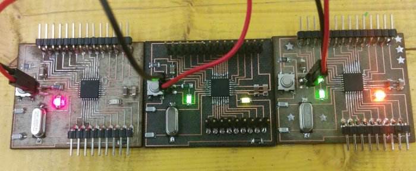
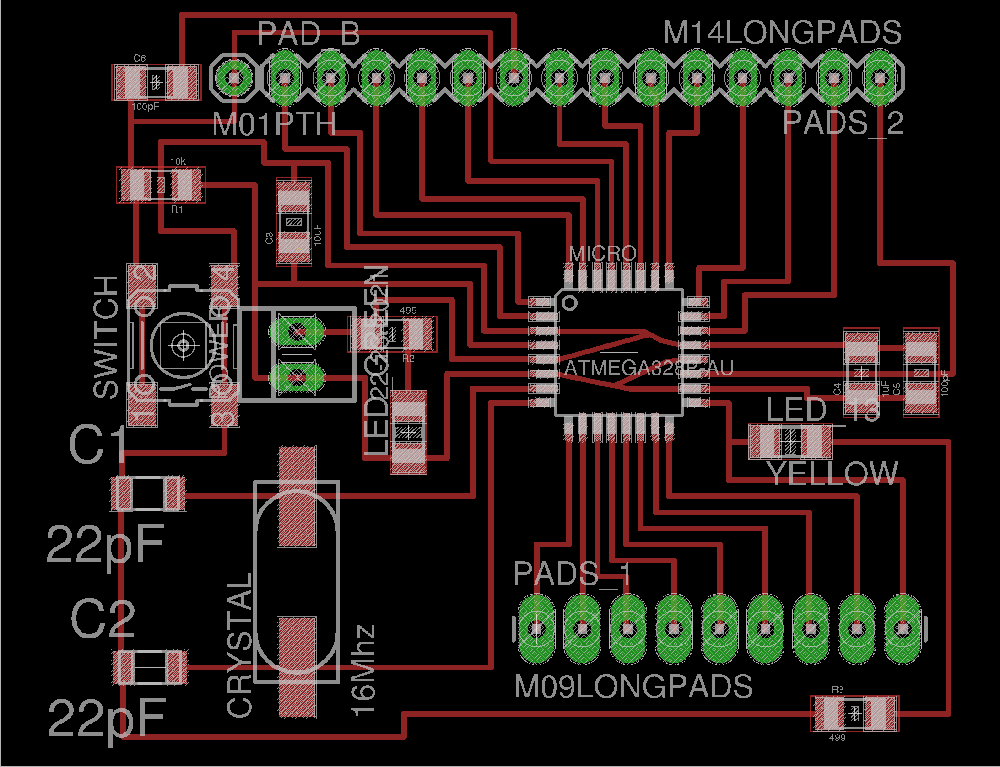
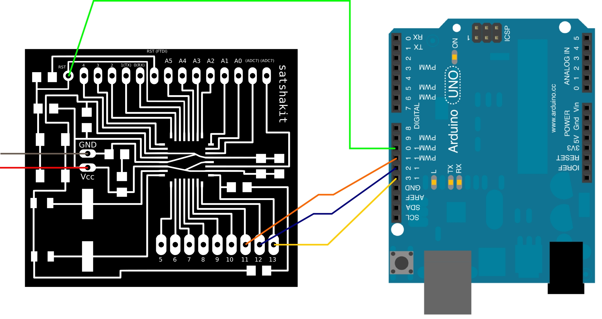
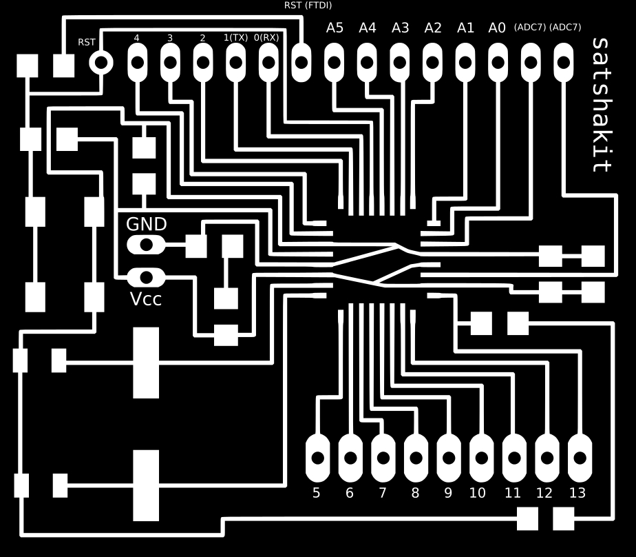

<h1 style="font-family: courier;" align="center"> satshakit</h1>

<i>An improved & fabbable Fabkit 100% Arduino IDE/libraries compatible board.</i>

  

The story
--
Satshakit born during my **[FabAcademy2015](http://fabacademy.org/archives/2015/eu/students/ingrassia.daniele/index.html)**  as one the first test boards for my quadcopter final project. As some of my fellow students had difficulties with **[Fabkit](http://fabacademy.org/archives/2015/doc/fabkit-0.4.html)**, they tried to make this prototype board. The board was very appreciated that now almost all my fellow students made it for their exercises, or use it as a **starting point for their final projects**. Thus I decided to do this release, if anyone wants to try it.

What is satshakit?
--

Satshakit is an Arduino compatible, fabbable board, and also an improved version of [Fabkit](http://fabacademy.org/archives/2015/doc/fabkit-0.4.html). 

Main **improvements** over Fabkit are:

- **16Mhz** instead of 8Mhz
- **crystal** instead of resonator
- it **costs less** (9.23 euro vs 13.11 euro)
- it uses **default Arduino IDE** (satshakit is recognized as Arduino UNO) instead of a patched Arduino IDE
- ADC6/7 connected instead of ADC6/7 not connected
- larger space to easy soldering
- almost **rect traces** instead of almost oblique ones
- power led instead of none

Getting Started
--
You can easily make satshakit with a **CNC mill** or with a (more expensive) **CO2/fiber** laser cutting machine.

Satshakit is made up of very **common components**. Here is **BOM** of the components:

- [excel](https://github.com/satshas/satshakit/raw/master/docs/satshakit_BOM.xlsx)
- [open document](https://github.com/satshas/satshakit/raw/master/docs/satshakit_BOM.ods)

When you finish solder satshakit, you're ready to program it.
If you want to use satshakit as an Arduino, you first need to **upload Arduino bootloader**.
 
To do this you need to use a **programmer**, for example another Arduino or FabISP.

Here is the connection schema to program satshakit with an Arduino:

And here is the connection schema to program it with FabISP:

Once everything is connected, follow these steps to upload Arduino bootloader:

1. open Arduino IDE 
2. select proper programmer (for example Arduino as ISP) 
3. select Arduino UNO as board
4. click on tools->Burn Bootloader.

Once Arduino bootloader is uploaded, you can use the above configurations to upload and use you favourite sketch.
Remember that you always need a programmer, and to select **File->Upload using a programmer** to upload the code to satshakit.

Here is the Arduino pinout on satshakit:

What's in the repo
--
- **docs**: BOM files and a ready shopping cart for Farnell.
- **egle_schematic**: eagle project of satshakit
- **media**: svg of satshakit, connections schemas, other images

Videos
--
satshakit programmed with a FabISP:

Here are some videos of satshakit while is working with **different configuration and/or sensors**:

Author
--
- **Daniele Ingrassia**
- **ingrassiada@gmail.com**
- **[Linkedin](http://it.linkedin.com/in/danieleingrassia)**

License
--
This work is licensed under GNU Lesser General Public License v2.1 ([LGPL](http://www.gnu.org/licenses/old-licenses/lgpl-2.1.html)).

Disclaimer  
--
This hardware/software is provided "as is", and you use the hardware/software at your own risk. Under no circumstances shall any author be liable for direct, indirect, special, incidental, or consequential damages resulting from the use, misuse, or inability to use this hardware/software, even if the authors have been advised of the possibility of such damages.  
